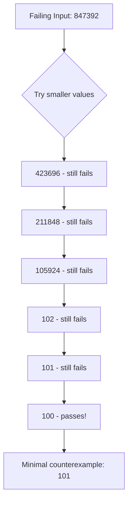

# Shrinking

When a property fails, quickchpl automatically **shrinks** the failing input to find the minimal counterexample.

## Why Shrinking?

Consider this buggy function:

```chapel
proc buggyAbs(x: int): int {
  if x > 100 then return -x;  // Bug: wrong sign for large numbers
  return if x >= 0 then x else -x;
}
```

Without shrinking, a failure might report:

```
✗ abs is non-negative FAILED
  Counterexample: 847392
```

With shrinking:

```
✗ abs is non-negative FAILED
  Counterexample: 847392
  Shrunk to: 101
```

**101** is much more useful for debugging than 847392!

## How Shrinking Works



## Shrinking Strategies

Each type has its own shrinking strategy:

### Integers

1. Try 0 (the simplest integer)
2. Binary search towards 0
3. Try immediate neighbors

```chapel
shrinkInt(100) → [0, 50, 25, 12, 6, 3, 1, 99]
```

### Real Numbers

1. Try 0.0
2. Truncate to integer
3. Round to nearest integer
4. Binary search towards 0

```chapel
shrinkReal(3.14159) → [0.0, 3.0, 1.57, 0.785, ...]
```

### Booleans

- `true` shrinks to `false`
- `false` has no shrinks

### Strings

1. Try empty string
2. Remove characters from the end
3. Remove single characters
4. Simplify characters to 'a'

```chapel
shrinkString("hello") → ["", "h", "he", "hel", "hell", "ello", ...]
```

### Lists

1. Try empty list
2. Remove elements from the end
3. Remove single elements
4. Shrink individual elements

### Tuples

Shrink each component independently and in combination.

## Controlling Shrinking

### Disable Shrinking

```chapel
var runner = new PropertyRunner(shrinkEnabled = false);
var result = runner.check(myProperty);
```

### Limit Shrinking Steps

```chapel
var runner = new PropertyRunner(maxShrinkSteps = 100);
```

### Shrinking Timeout

```chapel
var runner = new PropertyRunner(shrinkTimeout = 5.0);  // 5 seconds
```

## Custom Shrinkers

For custom types, you can provide your own shrinker:

```chapel
proc shrinkMyType(value: MyType): list(MyType) {
  var candidates: list(MyType);
  // Add simpler versions of value to candidates
  return candidates;
}
```

## Next Steps

- [Shrinkers Module](../modules/shrinkers.md) - Shrinker API reference
- [Properties](properties.md) - Writing properties
