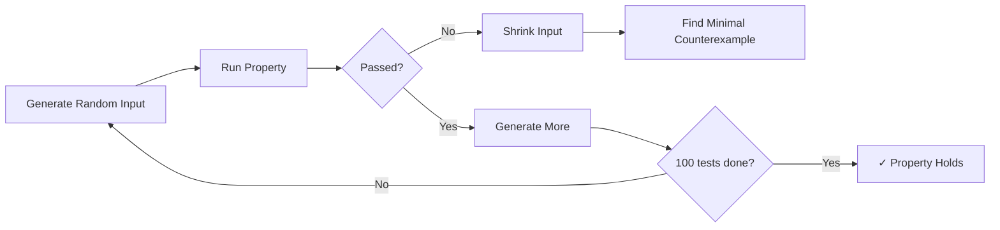
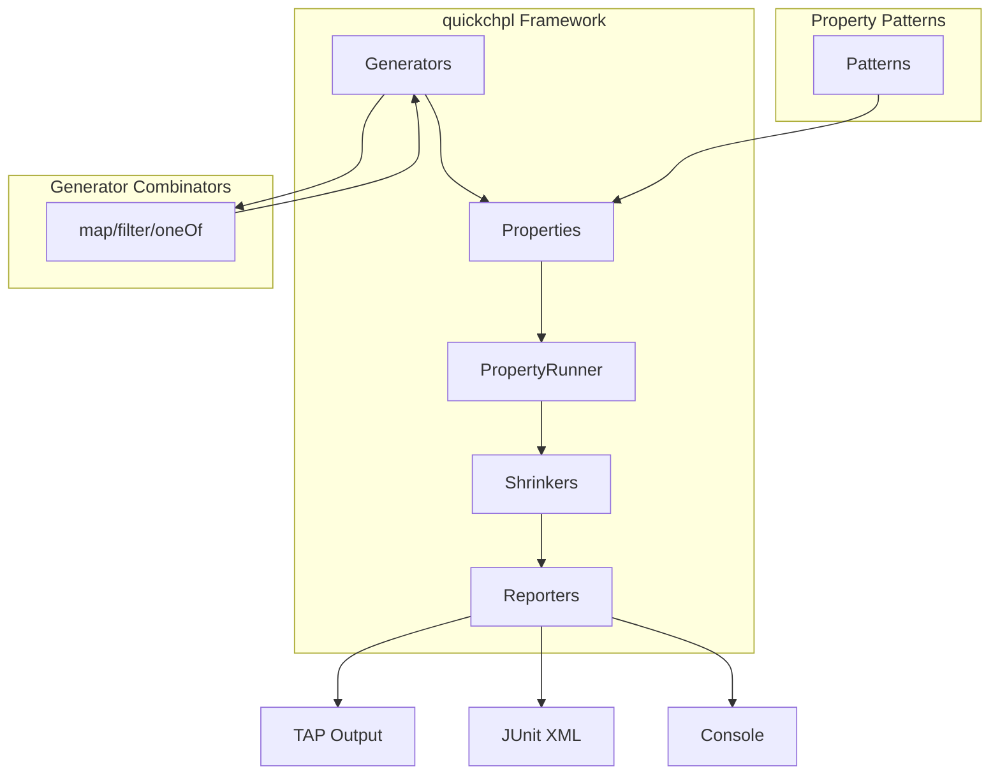

# quickchpl

**Property-Based Testing Framework for Chapel**

[](https://chapel-lang.org/)
[](LICENSE)
[](https://github.com/Jesssullivan/quickchpl/actions)

---

## What is Property-Based Testing?

Traditional unit tests verify specific examples. Property-based testing verifies *properties* that should hold for *all* valid inputs.



## Quick Example

```chapel
use quickchpl;

// Define a property: addition is commutative
var prop = property("addition commutes",
                    tupleGen(intGen(), intGen()),
                    lambda((a, b): (int, int)) {
                      return a + b == b + a;
                    });

// Check the property with 100 random inputs
var result = check(prop);

if result.passed {
  writeln("✓ Property holds for all ", result.numTests, " tests");
} else {
  writeln("✗ Counterexample: ", result.failureInfo);
}
```

## Key Features

<div class="grid cards" markdown>

-   :material-dice-multiple:{ .lg .middle } **Generators**

    ---

    Create random test data with composable generators for integers,
    reals, booleans, strings, tuples, and lists.

    [:octicons-arrow-right-24: Learn about generators](concepts/generators.md)

-   :material-flask-outline:{ .lg .middle } **Properties**

    ---

    Define properties as functions that should return true for all inputs.
    Compose complex properties from simple predicates.

    [:octicons-arrow-right-24: Writing properties](concepts/properties.md)

-   :material-arrow-collapse:{ .lg .middle } **Shrinking**

    ---

    When a property fails, quickchpl automatically shrinks the input
    to find the *minimal* counterexample.

    [:octicons-arrow-right-24: Understanding shrinking](concepts/shrinking.md)

-   :material-format-list-checks:{ .lg .middle } **Patterns**

    ---

    Ready-to-use property patterns for testing algebraic properties,
    round-trips, ordering relations, and more.

    [:octicons-arrow-right-24: Common patterns](modules/patterns.md)

</div>

## Installation

=== "Mason (Recommended)"

    ```bash
    mason add quickchpl
    ```

=== "Manual"

    ```bash
    git clone https://github.com/Jesssullivan/quickchpl.git
    export CHPL_MODULE_PATH=$CHPL_MODULE_PATH:$PWD/quickchpl/src
    ```

## Modules Overview

| Module | Description |
|--------|-------------|
| [`Generators`](modules/generators.md) | Random value generators |
| [`Properties`](modules/properties.md) | Property definition and execution |
| [`Shrinkers`](modules/shrinkers.md) | Counterexample minimization |
| [`Reporters`](modules/reporters.md) | Test result formatting |
| [`Combinators`](modules/combinators.md) | Generator composition |
| [`Patterns`](modules/patterns.md) | Common property patterns |

## Architecture



## Why quickchpl?

!!! success "Zero Dependencies"
    No external packages required. Just Chapel.

!!! success "Chapel-Native"
    Designed for Chapel's parallel programming model.

!!! success "Intelligent Shrinking"
    Automatic minimization of failing test cases.

!!! success "Comprehensive Patterns"
    Built-in patterns for common mathematical properties.

## Getting Help

- **GitHub Issues**: [Report bugs or request features](https://github.com/Jesssullivan/quickchpl/issues)
- **Chapel Discourse**: [Ask questions about Chapel](https://chapel.discourse.group/)
- **Examples**: [Browse example code](examples/basic.md)

---

*Inspired by [QuickCheck](https://hackage.haskell.org/package/QuickCheck) (Haskell) and [Hypothesis](https://hypothesis.readthedocs.io/) (Python).*
