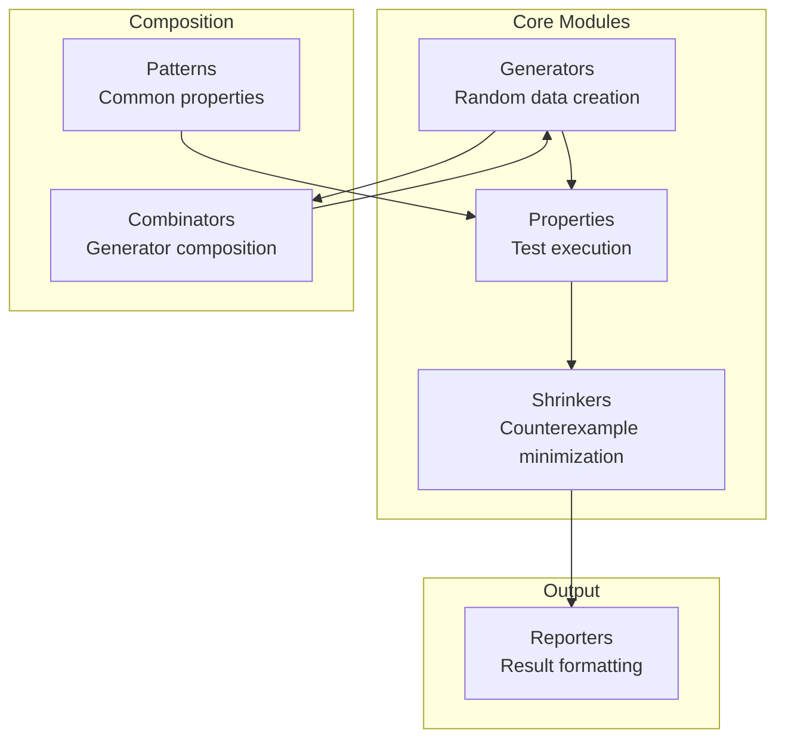

# Modules Overview

quickchpl is organized into six modules, each with a specific responsibility.

## Architecture



## Module Summary

| Module | Purpose | Key Types |
|--------|---------|-----------|
| [Generators](generators.md) | Create random test data | `IntGenerator`, `RealGenerator`, `StringGenerator` |
| [Properties](properties.md) | Define and run properties | `Property`, `PropertyRunner`, `TestResult` |
| [Shrinkers](shrinkers.md) | Minimize failing inputs | `ShrinkResult`, `shrink()` |
| [Reporters](reporters.md) | Format test output | `formatResult()`, `formatTAP()`, `formatJUnit()` |
| [Combinators](combinators.md) | Compose generators | `map()`, `filter()`, `oneOf()`, `frequency()` |
| [Patterns](patterns.md) | Common property patterns | `isCommutative()`, `isAssociative()`, etc. |

## Import Patterns

### Import Everything

```chapel
use quickchpl;  // Imports all modules
```

### Selective Import

```chapel
use Generators;
use Properties;
use Patterns;
```

### Qualified Import

```chapel
import Generators.intGen;
import Properties.check;
```

## Quick Reference

### Generators

```chapel
intGen()                    // Integers
intGen(-100, 100)          // Bounded integers
realGen()                  // Real numbers
boolGen()                  // Booleans
stringGen()                // Strings
stringGen(20)              // Strings up to 20 chars
tupleGen(g1, g2)           // Tuples
listGen(gen)               // Lists
```

### Properties

```chapel
property(name, gen, pred)   // Define property
check(prop)                // Run 100 tests
quickCheck(gen, pred)      // Quick inline test
```

### Combinators

```chapel
map(gen, f)                // Transform values
filter(gen, pred)          // Filter values
oneOf(g1, g2, g3)          // Choose randomly
frequency([(1,g1),(2,g2)]) // Weighted choice
suchThat(gen, pred)        // Filter with retry
```

### Patterns

```chapel
isCommutative(a, b, op)    // a op b = b op a
isAssociative(a, b, c, op) // (a op b) op c = a op (b op c)
isIdempotent(x, f)         // f(f(x)) = f(x)
isInvolution(x, f)         // f(f(x)) = x
isRoundTrip(x, enc, dec)   // dec(enc(x)) = x
implies(cond, concl)       // Logical implication
```

### Reporters

```chapel
printResult(passed, name, n)           // Console output
formatTAP(results)                     // TAP format
formatJUnit(suite, results)            // JUnit XML
greenText(s), redText(s), yellowText(s) // Colors
```
